# DSO101 Assignment 2 - Jenkins CI/CD Pipeline

**Student Name:** UgayNobu  
**Student ID:** 02240369  
**Course:** DSO101 - Continuous Integration and Continuous Deployment  

---

## Task 1: Jenkins Setup for Node.js

### Overview
In Task 1, Jenkins was installed and configured locally on `localhost:8080`. The required plugins were installed and Node.js was configured as a global tool for the pipeline to use.

---

### Step 1: Install Jenkins

Downloaded Jenkins from jenkins.io/download and ran it on `localhost:8080`:

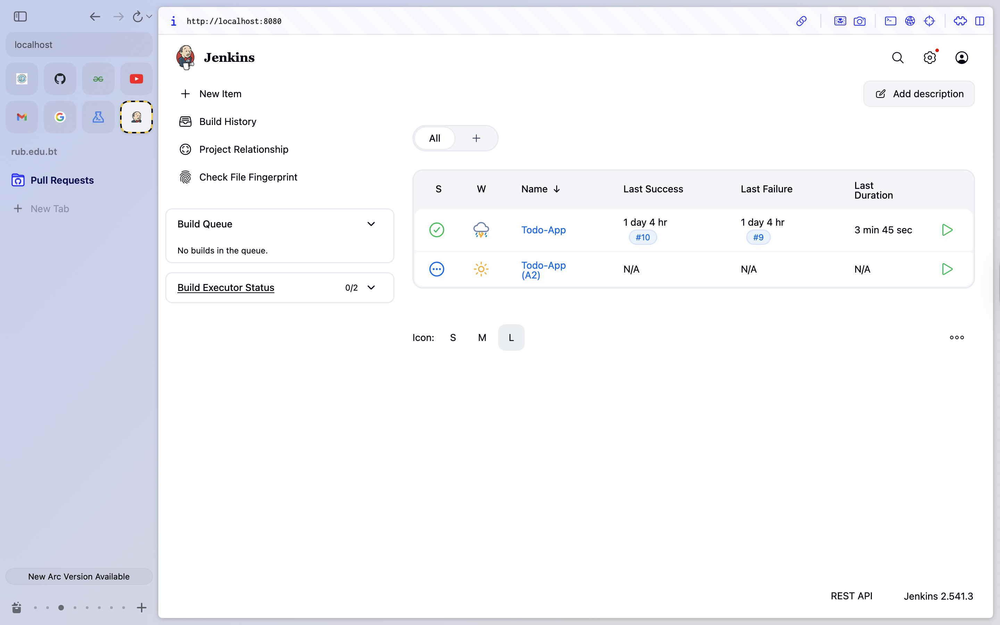

---

### Step 2: Install Required Plugins

Navigated to **Manage Jenkins > Plugins > Installed plugins** and installed the NodeJS, Pipeline, and GitHub Integration plugins:

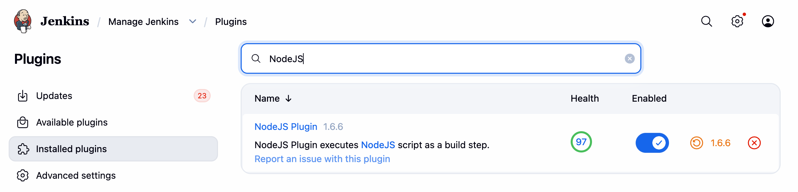

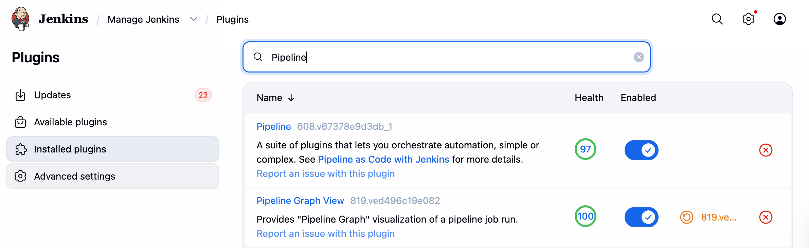

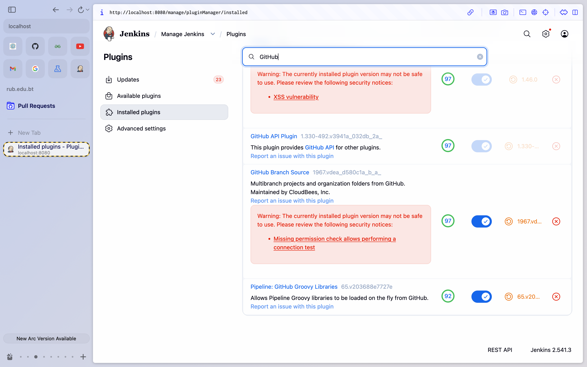

---

### Step 3: Configure Node.js in Jenkins

Navigated to **Manage Jenkins > Tools > NodeJS installations** and added NodeJS 20.15.1, set to install automatically from nodejs.org:

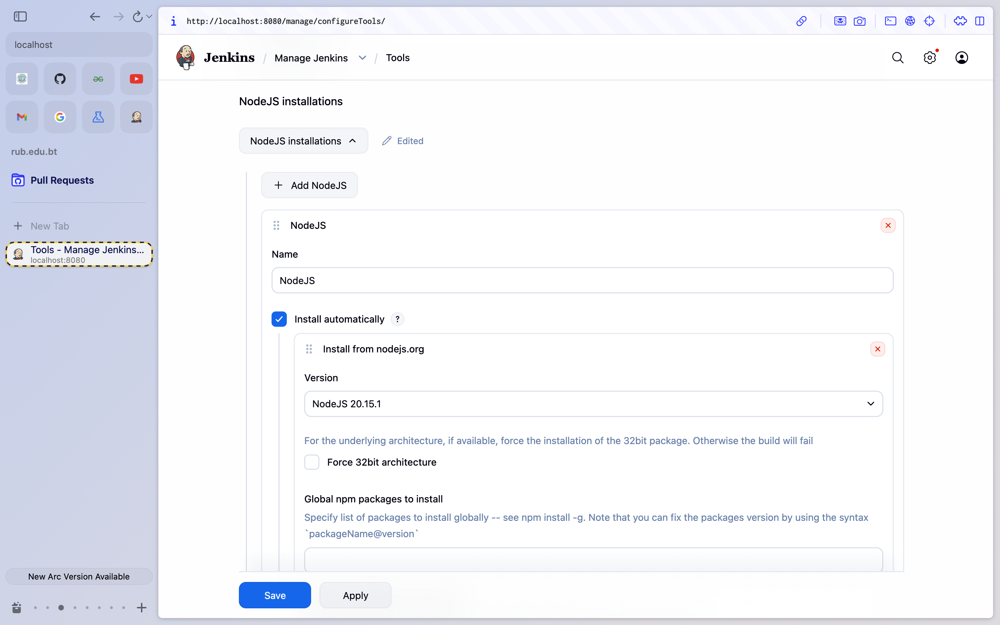

---

## Task 2: GitHub Repository Setup

### Overview
In Task 2, the GitHub repository was connected to Jenkins using a Personal Access Token. Docker Hub credentials were also added to enable image pushing from the pipeline.

---

### Step 1: Add Credentials in Jenkins

Navigated to **Manage Jenkins > Credentials** and added the GitHub username/PAT credential and the `docker-hub-creds` credential for Docker Hub access:

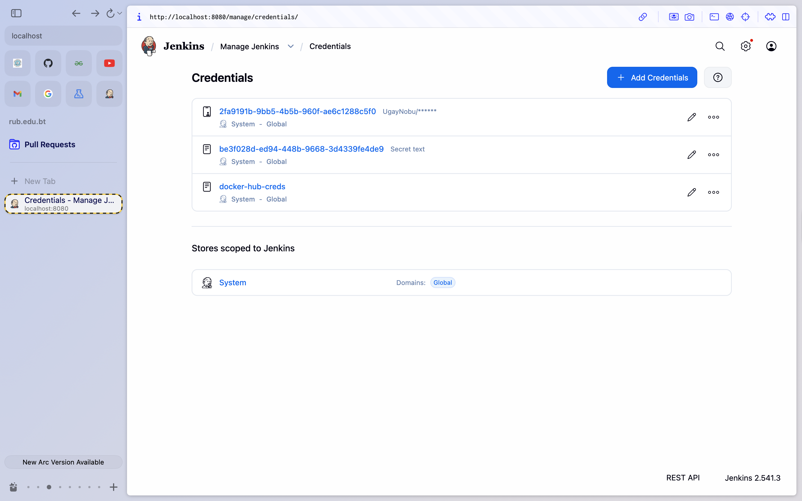

---

## Task 3: Jenkinsfile Configuration

### Overview
In Task 3, a `Jenkinsfile` was created in the root of the GitHub repository defining five stages: Checkout, Install, Build, Test, and Deploy.

---

### Step 1: Create Jenkinsfile

Created `Jenkinsfile` in the repository root with the following pipeline:

```groovy
pipeline {
    agent any

    tools {
        nodejs 'NodeJS'
    }

    environment {
        PATH = "/usr/local/bin:/opt/homebrew/bin:${env.PATH}"
    }

    stages {
        stage('Checkout') {
            steps {
                git branch: 'main',
                    url: 'https://github.com/UgayNobu/UgayNobu_02240369_DSO101_A2.git',
                    credentialsId: 'github-creds'
            }
        }

        stage('Install') {
            steps {
                dir('todo-app/backend') {
                    sh 'npm install'
                }
                dir('todo-app/frontend') {
                    sh 'npm install'
                }
            }
        }

        stage('Build') {
            steps {
                dir('todo-app/frontend') {
                    sh 'npm run build'
                }
                dir('todo-app/backend') {
                    sh 'npm run build'
                }
            }
        }

        stage('Test') {
            steps {
                dir('todo-app/backend') {
                    sh 'npm test'
                }
            }
            post {
                always {
                    junit 'todo-app/backend/junit.xml'
                }
            }
        }

        stage('Deploy') {
            steps {
                withCredentials([string(
                    credentialsId: 'docker-hub-creds',
                    variable: 'DOCKER_PASS'
                )]) {
                    sh '''
                        echo "$DOCKER_PASS" | docker login -u ugaynobu --password-stdin
                        docker build -t ugaynobu/be-todo:02240369 todo-app/backend
                        docker push ugaynobu/be-todo:02240369
                        docker build -t ugaynobu/fe-todo:02240369 todo-app/frontend
                        docker push ugaynobu/fe-todo:02240369
                        docker logout
                    '''
                }
            }
        }
    }
}
```

---

### Step 2: Push Jenkinsfile to GitHub

Pushed the Jenkinsfile to the `main` branch of the GitHub repository:

```bash
git add Jenkinsfile
git commit -m "Add Jenkinsfile for Assignment 2"
git push origin main
```

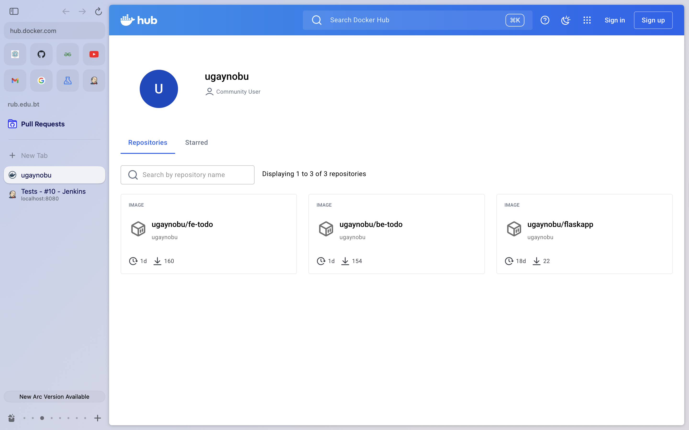

---

## Task 4: Run the Pipeline

### Overview
In Task 4, the pipeline was created in Jenkins and triggered. After several iterations resolving configuration issues, Build #10 completed successfully with all stages passing and the Docker images pushed to Docker Hub.

---

### Step 1: Pipeline Build History

Created the pipeline in Jenkins as **New Item > Pipeline**, configured it to use **Pipeline script from SCM** pointing to the GitHub repository, and ran the pipeline. Build #10 was the final successful build with a consistently passing test trend:

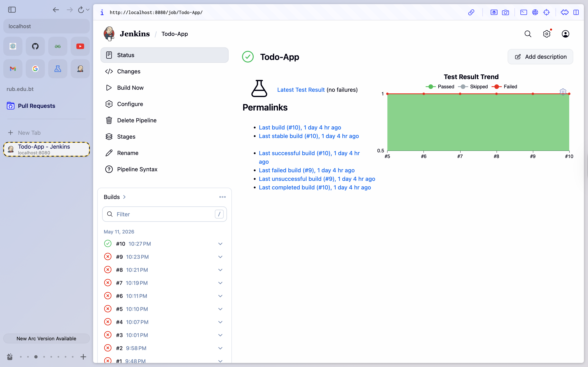

---

### Step 2: Successful Build

Build #10 completed successfully on May 11, 2026, taking 3 minutes 45 seconds. It was triggered by user Ugyen Norbu and pulled from the `main` branch with Tests showing no failures:

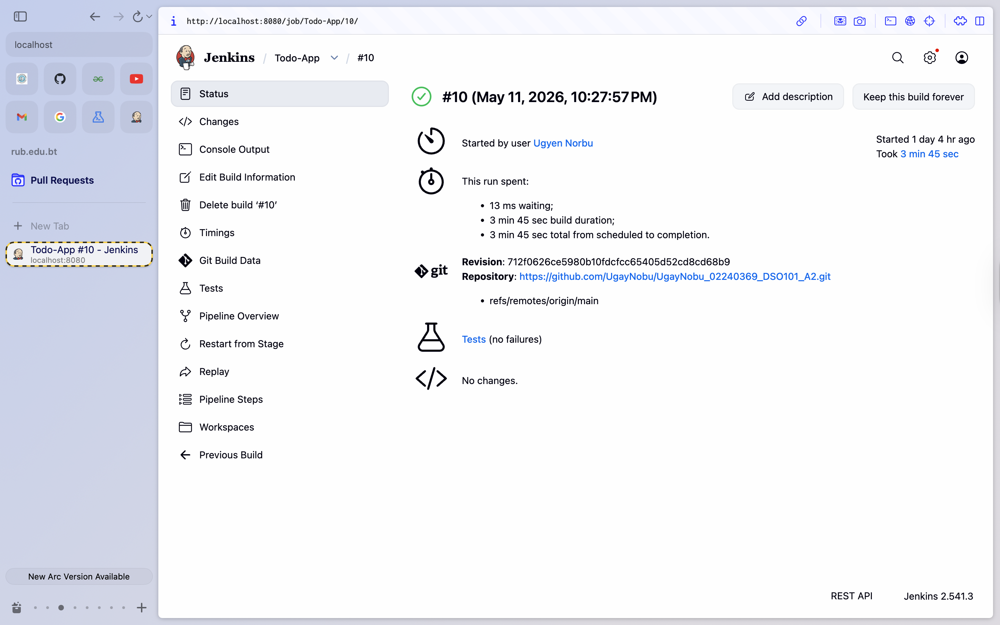

---

### Step 3: Console Output

The console output confirms all Docker image layers were pushed to Docker Hub and the pipeline completed with `Finished: SUCCESS`:

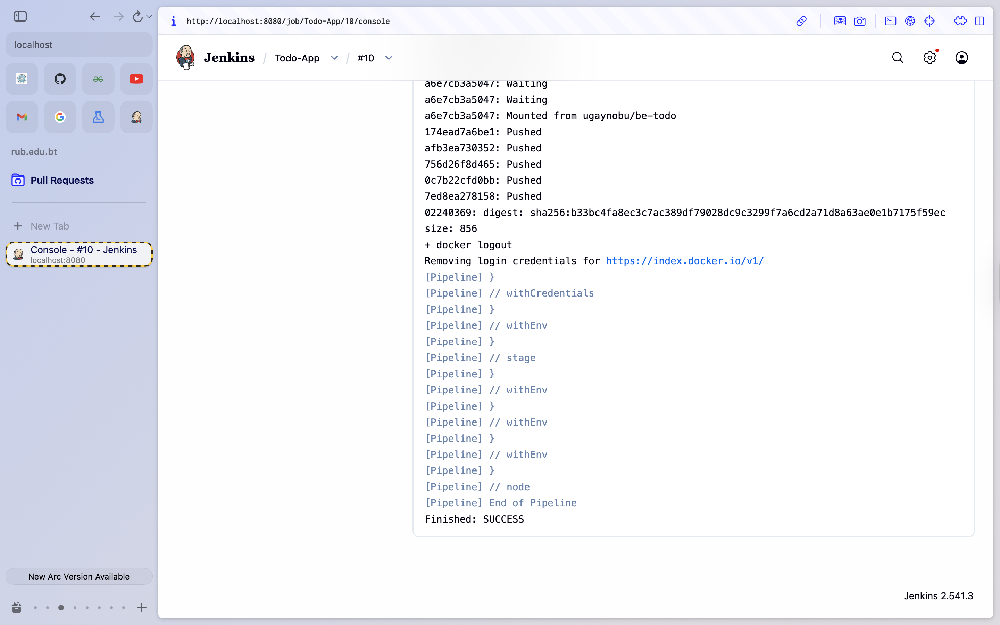

---

### Step 4: Test Results

The Jenkins test report for Build #10 shows 1 test passing with 0 failures and 0 skipped, completing in 13 ms:

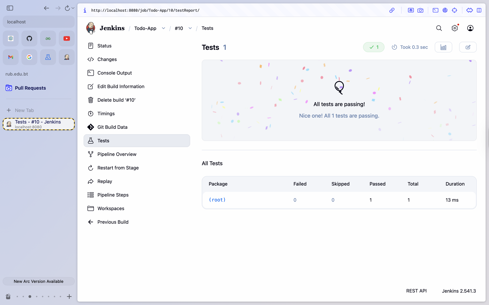

---

### Step 5: Docker Hub Image

The Docker Hub profile for `ugaynobu` confirms the `be-todo` and `fe-todo` images were successfully pushed, both updated within 1 day:

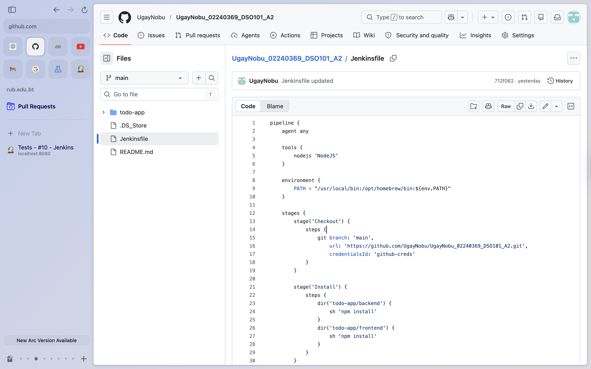

---

### Task 4 Result

| Feature | Status |
|---------|--------|
| Jenkins pipeline created | ✅ Working |
| GitHub checkout stage | ✅ Working |
| npm install stage | ✅ Working |
| npm build stage | ✅ Working |
| Jest unit tests passing | ✅ Working |
| Docker image pushed to Hub | ✅ Working |

---

## Links

| Resource | URL |
|----------|-----|
| GitHub Repository | `https://github.com/UgayNobu/UgayNobu_02240369_DSO101_A2` |
| Docker Hub (Backend) | `https://hub.docker.com/r/ugaynobu/be-todo` |
| Docker Hub (Frontend) | `https://hub.docker.com/r/ugaynobu/fe-todo` |

---

## References

- [Docker Documentation](https://docs.docker.com/)
- [Jenkins Documentation](https://www.jenkins.io/doc/)
- [NodeJS Plugin for Jenkins](https://plugins.jenkins.io/nodejs/)
- [Jest Documentation](https://jestjs.io/docs/getting-started)
- [jest-junit Reporter](https://github.com/jest-community/jest-junit)
- [Docker Pipeline Plugin](https://plugins.jenkins.io/docker-workflow/)
- [GitHub Personal Access Tokens](https://docs.github.com/en/authentication/keeping-your-account-and-data-secure/managing-your-personal-access-tokens)